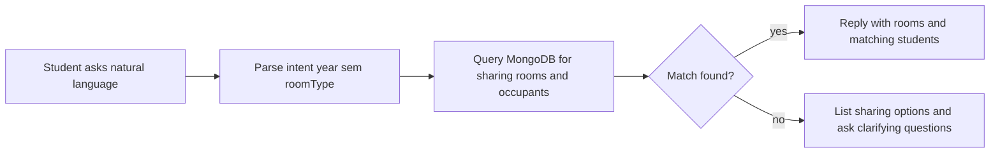

# Training the booking chat for year/semester + sharing-room requests

## What “training” actually means here

- **Fine-tuning an LLM** is usually *not* the right first step for this. You need **correct facts** (who is in which room, their year/semester). Those facts must come from **your database** (or admin-entered rules), not from the model guessing.
- Practical approach: **structured data + retrieval + safe wording in chat** (rules engine and/or LLM that only speaks from query results).

## Current gap in this codebase

- [`backend/models/User.js`](backend/models/User.js) has **no** `academicYear` or `semester` (or similar) fields.
- [`backend/models/Booking.js`](backend/models/Booking.js) ties a student to hostel/room/bed but does **not** store year/semester for matching roommates.
- [`backend/services/bookingChatService.js`](backend/services/bookingChatService.js) builds context from booking + hostel + room features only—**no** cross-student academic matching.

So the behavior you described (“search sharing room with 1 year 2 semester student; if none, suggest all sharing and ask year/semester”) is a **feature design + schema + API + chat handler** task, not something you can get by “training” the existing bot alone.

## Recommended implementation (honest, testable)

### 1) Add student academic fields (source of truth)

- Extend `User` (or a separate `StudentProfile` collection) with e.g. `academicYear` (number or string like `Y1`) and `semester` (e.g. `S1`/`S2`), collected at signup or profile edit.
- Validate on write (allowed values only) so chat queries stay reliable.

### 2) Define what “roommate search” means in data terms

- **Sharing room** is already implied by `roomType === 'sharing'` in [`backend/models/RoomSchema.js`](backend/models/RoomSchema.js) (and your UI filters).
- For each **candidate sharing room** (available bed or occupied with students you can list):
  - Find **other students** with `pending`/`confirmed` bookings in the **same room** (same hostel + normalized `roomNumber`).
  - Join to `User` to read `academicYear` + `semester`.
- Return to the chat layer:
  - `matches`: rooms where at least one occupant matches requested year+semester.
  - `noMatchButSharing`: list of sharing rooms (or hostels) when filter returns empty.
  - **Never** invent a match if the query is empty.

### 3) Chat behavior (your example flow)

- **Parse** the user message for: room type (sharing), desired year, desired semester (regex + keyword map + optional small LLM extraction with strict JSON schema—LLM only extracts slots, does not invent DB rows).
- **If matches exist:** respond with a short list: hostel name, room label, who matches (year/semester), and next step (“use filters / book this room” links are UI-only; v1 stays non-mutating per your earlier plan).
- **If no matches:** respond with:
  - “No sharing room currently shows a roommate with Year X Semester Y under your filters.”
  - Then **suggest**: list available sharing rooms (or categories) and **ask**: “Which year and semester do you prefer?” (chips or follow-up questions).
- Store the last clarified year/semester in **conversation metadata** ([`backend/models/ChatMessage.js`](backend/models/ChatMessage.js) `metadata`) so the next message can narrow results without repeating.

### 4) Wire into existing chat API

- Add a dedicated intent in [`backend/services/bookingChatService.js`](backend/services/bookingChatService.js) (e.g. `roommate_preference`) that calls a new small service module e.g. `backend/services/roommateSearchService.js` using the queries above.
- Pass **only summarized, non-sensitive** facts into any LLM fallback (hostel/room ids, year/sem labels)—not full addresses or document paths.

### 5) Privacy and safety

- Only show **other students’ year/semester** if product policy allows; otherwise show **counts** (“2 students in that year/semester in this room”) or anonymized labels.
- Admin setting: “share academic year in roommate suggestions: on/off.”

## Optional later: RAG / documents

- If you add a **handbook PDF** (policies, how sharing works), you can add **RAG** (embeddings + retrieval) for FAQs. That still does **not** replace database-backed roommate matching.

## Acceptance criteria (for your example)

- Asking *“sharing room with 1 year 2 semester student”* triggers a **DB-backed** response.
- When no row matches, the bot **admits no match** and **lists sharing options + asks** year/semester.
- No fabricated roommate matches when the query returns zero rows.
